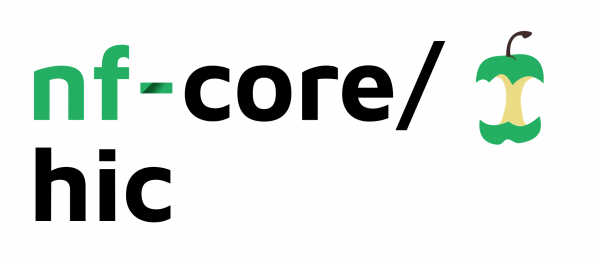

# 

**Analysis of Chromosome Conformation Capture data (Hi-C)**.

[](https://github.com/nf-core/hic/actions)
[](https://github.com/nf-core/hic/actions)
[](https://www.nextflow.io/)

[](https://bioconda.github.io/)
[](https://hub.docker.com/r/nfcore/hic)

[](https://doi.org/10.5281/zenodo.2669513)
[](https://nfcore.slack.com/channels/hic)

## Introduction

This pipeline was originally set up from the
[HiC-Pro workflow](https://github.com/nservant/HiC-Pro).
It was designed to process Hi-C data from raw FastQ files (paired-end Illumina
data) to normalized contact maps.
The current version supports most protocols, including digestion protocols as
well as protocols that do not require restriction enzymes such as DNase Hi-C.
In practice, this workflow was successfully applied to many data-sets including
dilution Hi-C, in situ Hi-C, DNase Hi-C, Micro-C, capture-C, capture Hi-C or
HiChip data.

Contact maps are generated in standard formats including HiC-Pro, and cooler for
downstream analysis and visualization.
Addition analysis steps such as compartments and TADs calling are also available.

The pipeline is built using [Nextflow](https://www.nextflow.io), a workflow tool
to run tasks across multiple compute infrastructures in a very portable manner.
It comes with docker / singularity containers making installation trivial and
results highly reproducible.

## Pipeline summary

1. HiC-Pro data processing ([`HiC-Pro`](https://github.com/nservant/HiC-Pro))
   1. Mapping using a two steps strategy to rescue reads spanning the ligation
   sites ([`bowtie2`](http://bowtie-bio.sourceforge.net/bowtie2/index.shtml))
   2. Detection of valid interaction products
   3. Duplicates removal
   4. Generate raw and normalized contact maps ([`iced`](https://github.com/hiclib/iced))
2. Create genome-wide contact maps at various resolutions ([`cooler`](https://github.com/open2c/cooler))
3. Contact maps normalization using balancing algorithm ([`cooler`](https://github.com/open2c/cooler))
4. Export to various contact maps formats ([`HiC-Pro`](https://github.com/nservant/HiC-Pro), [`cooler`](https://github.com/open2c/cooler))
5. Quality controls ([`HiC-Pro`](https://github.com/nservant/HiC-Pro), [`HiCExplorer`](https://github.com/deeptools/HiCExplorer))
6. Compartments calling ([`cooltools`](https://cooltools.readthedocs.io/en/latest/))
7. TADs calling ([`HiCExplorer`](https://github.com/deeptools/HiCExplorer), [`cooltools`](https://cooltools.readthedocs.io/en/latest/))
8. Quality control report ([`MultiQC`](https://multiqc.info/))

## Quick Start

1. Install [`nextflow`](https://nf-co.re/usage/installation) (`>=20.04.0`)

2. Install any of [`Docker`](https://docs.docker.com/engine/installation/), [`Singularity`](https://www.sylabs.io/guides/3.0/user-guide/), [`Podman`](https://podman.io/), [`Shifter`](https://nersc.gitlab.io/development/shifter/how-to-use/) or [`Charliecloud`](https://hpc.github.io/charliecloud/) for full pipeline reproducibility _(please only use [`Conda`](https://conda.io/miniconda.html) as a last resort; see [docs](https://nf-co.re/usage/configuration#basic-configuration-profiles))_

3. Download the pipeline and test it on a minimal dataset with a single command

    ```bash
    nextflow run nf-core/hic -profile test,<docker/singularity/podman/shifter/charliecloud/conda/institute>
    ```

    > Please check [nf-core/configs](https://github.com/nf-core/configs#documentation)
    to see if a custom config file to run nf-core pipelines already exists for your Institute.
    If so, you can simply use `-profile <institute>` in your command.
    This will enable either `docker` or `singularity` and set the appropriate execution
    settings for your local compute environment.

4. Start running your own analysis!

    ```bash
    nextflow run nf-core/hic -profile <docker/singularity/podman/shifter/charliecloud/conda/institute> --input '*_R{1,2}.fastq.gz' --genome GRCh37
    ```

## Documentation

The nf-core/hic pipeline comes with documentation about the pipeline: [usage](https://nf-co.re/hic/usage) and [output](https://nf-co.re/hic/output).

For further information or help, don't hesitate to get in touch on [Slack](https://nfcore.slack.com/channels/hic).
You can join with [this invite](https://nf-co.re/join/slack).

## Credits

nf-core/hic was originally written by Nicolas Servant.

## Contributions and Support

If you would like to contribute to this pipeline, please see the [contributing guidelines](.github/CONTRIBUTING.md).

For further information or help, don't hesitate to get in touch on the [Slack `#hic` channel](https://nfcore.slack.com/channels/hic) (you can join with [this invite](https://nf-co.re/join/slack)).

## Citation

If you use nf-core/hic for your analysis, please cite it using the following
doi: [10.5281/zenodo.2669513](https://doi.org/10.5281/zenodo.2669513)

You can cite the `nf-core` publication as follows:

> **The nf-core framework for community-curated bioinformatics pipelines.**
>
> Philip Ewels, Alexander Peltzer, Sven Fillinger, Harshil Patel, Johannes Alneberg, Andreas Wilm, Maxime Ulysse Garcia, Paolo Di Tommaso & Sven Nahnsen.
>
> _Nat Biotechnol._ 2020 Feb 13. doi: [10.1038/s41587-020-0439-x](https://dx.doi.org/10.1038/s41587-020-0439-x).

In addition, references of tools and data used in this pipeline are as follows:

> **HiC-Pro: An optimized and flexible pipeline for Hi-C processing.**
>
> Nicolas Servant, Nelle Varoquaux, Bryan R. Lajoie, Eric Viara, Chongjian Chen, Jean-Philippe Vert, Job Dekker, Edith Heard, Emmanuel Barillot.
>
> Genome Biology 2015, 16:259 doi: [10.1186/s13059-015-0831-x](https://dx.doi.org/10.1186/s13059-015-0831-x)
