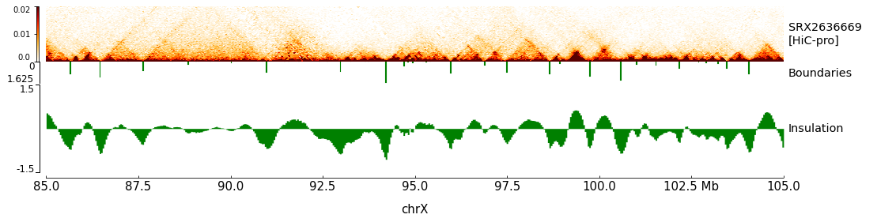
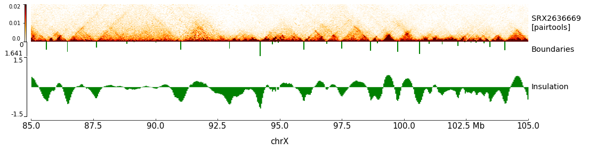

# nf-core/hic: Output

## Benchmark `HiC-Pro` vs `pairtools`

### Profile test

Comparison of the test profile run with `HiC-Pro` ;

```bash
nextflow run nf-core-hic/main.nf \
  -profile singularity,test \
  --processing 'hicpro' --save_pairs_intermediates \
  --outdir '/tmp/results_test_hicpro/'
```

and `bwa-mem/pairtools` ;

```bash
nextflow run nf-core-hic/main.nf \
  -profile singularity,test \
  --processing 'pairtools' --save_pairs_intermediates \
  --outdir '/tmp/results_test_pairtools/'
```

The idea here was just to have a look at the final list of selected (and unselected)
read pairs classified as valid interactions (or spurious interaction products)

Here is a quick summary statistics ;

```bash
# valid pairs from HiC-Pro = 64191
# valid pairs from pairtools = 79585
# common valid pairs = 59062 (69.72%)
# common filtered pairs = 281201 (87.42%)
----------------------------------------
# Difference in valid pairs = 25652 (30.28%)
# Unmapped with HiC-Pro = 19945 (77.75%)
# Unmapped with Pairtools = 443 (1.73%)
# Filtered by HiC-Pro only = 578 (2.25%)
# Filtered by Pairtools only = 4686 (18.27%)
----------------------------------------
# Difference in filtered pairs = 40478 (12.58%)
# Unmapped with HiC-Pro = 31210 (77.10%)
# Unmapped with Pairtools = 4004 (9.89%)
# Filtered by HiC-Pro only = 578 (1.43%)
# Filtered by Pairtools only = 4686 (11.58%)
```

Overall, we can see that **70%** of valid interactions are called by both `HiC-Pro` and `Pairtools`.
Regarding the 30% of read pairs which are different between the two tools, we can see that a large
majority (>75%) are due to differences in the read mapping (`bowtie2` versus `bwa-mem`).

The few other differences can be at least partly explain by differences in the read pairs selection such as how a read is assigned
to a restriction fragments, etc.

### Full test dataset (SRX2636669)

We then applied the same approach on the full test profile which is based on Mouse Hi-C data from embryonic stem cells
(Bonev et al., 2017 - GSE96107) processed either with `HiC-Pro` ;

```bash
nextflow run nf-core-hic/main.nf \
  --input './data/SRX2636669/samplesheet.csv' \
  --processing 'hicpro' --save_pairs_intermediates \
  --genome 'mm10' \
  --digestion 'dpnii' \
  --bin_size '40000,250000,500000,1000000' \
  --res_compartments '500000,250000' \
  --res_tads '40000,20000' \
  --outdir './results_SRX2636669_hicpro/' \
  -profile singularity
```

or `bwa-mem/pairtools` ;

```bash
nextflow run nf-core-hic/main.nf \
  --input './data/SRX2636669/samplesheet.csv' \
  --processing 'pairtools' --save_pairs_intermediates \
  --genome 'mm10' \
  --digestion 'dpnii' \
  --bin_size '40000,250000,500000,1000000' \
  --res_compartments '500000,250000' \
  --res_tads '40000,20000' \
  --outdir './results_SRX2636669_pairtools/'
  -profile singularity
```

As before, small statistics were computed to compare the list of valid (and not valid) interactions.

```bash
# valid pairs from HiC-Pro = 225982881
# valid pairs from pairtools = 229880874
# common valid pairs = 200026227 (78.18%)
# common filtered pairs = 71619180 (54.43%)
----------------------------------------
# Difference in valid pairs = 55811301 (21.82%)
# Unmapped with HiC-Pro = 21060023 (37.73%)
# Unmapped with Pairtools = 19570337 (35.07%)
# Filtered by HiC-Pro only = 8794624 (15.76%)
# Filtered by Pairtools only = 6386317 (11.44%)
----------------------------------------
# Difference in filtered pairs = 59967305 (45.57%)
# Unmapped with HiC-Pro = 30122043 (50.23%)
# Unmapped with Pairtools = 14664321 (24.45%)
# Filtered by HiC-Pro only = 8794624 (14.67%)
# Filtered by Pairtools only = 6386317 (10.65%)
```

Almost **80%** of valid interactions are called in common by `HiC-Pro` and `pairtools`.
As previously observed, most of the differences observed between the two tools are
explained by distinct mapping procedures.

Finally, we generated the contact maps around a specific regions on the X chromosome
using the `cool` files and the TADs calling generated with both tools.
**No difference is observed at the contact map level.**




